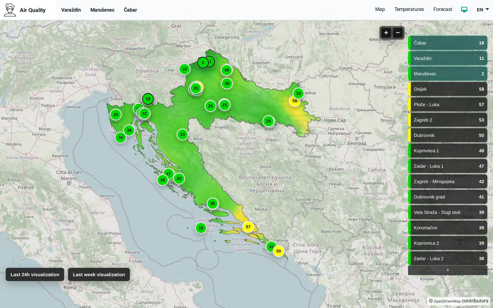
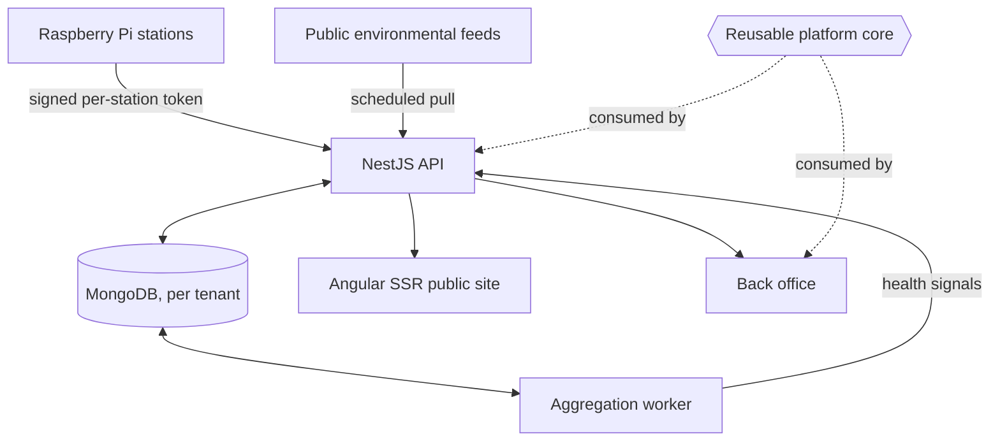
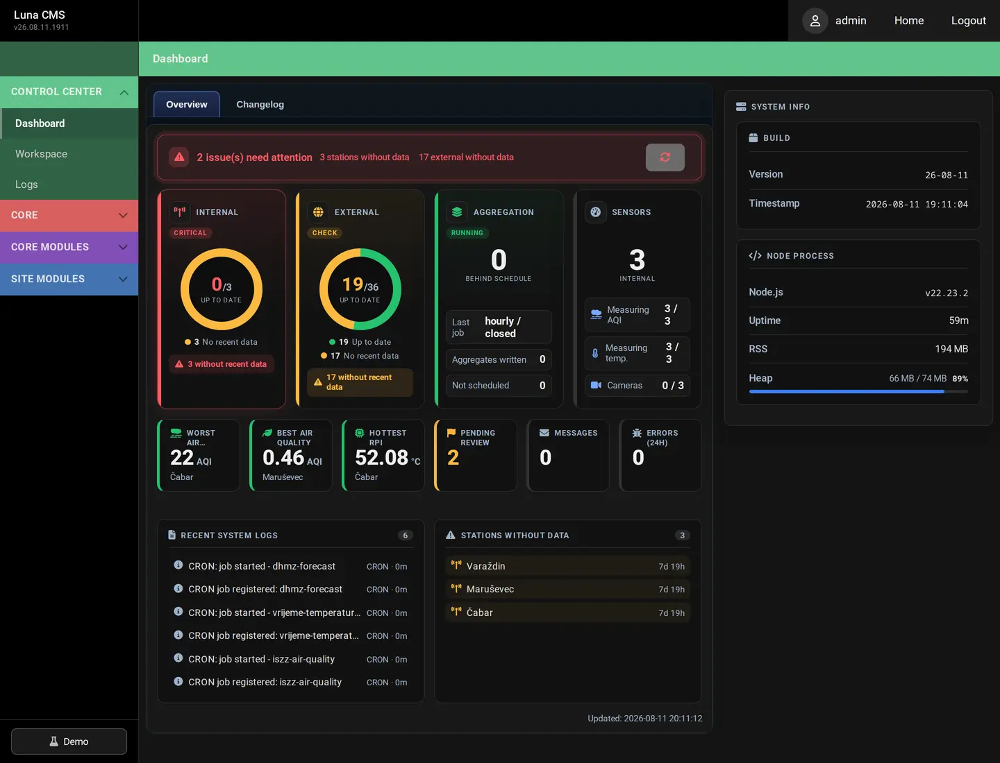
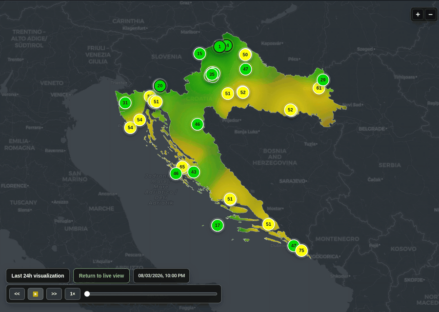
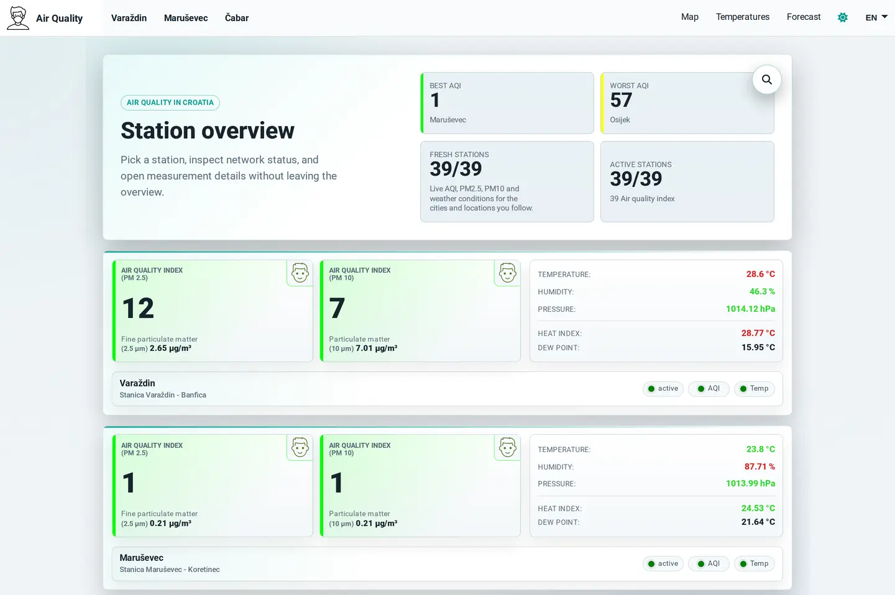
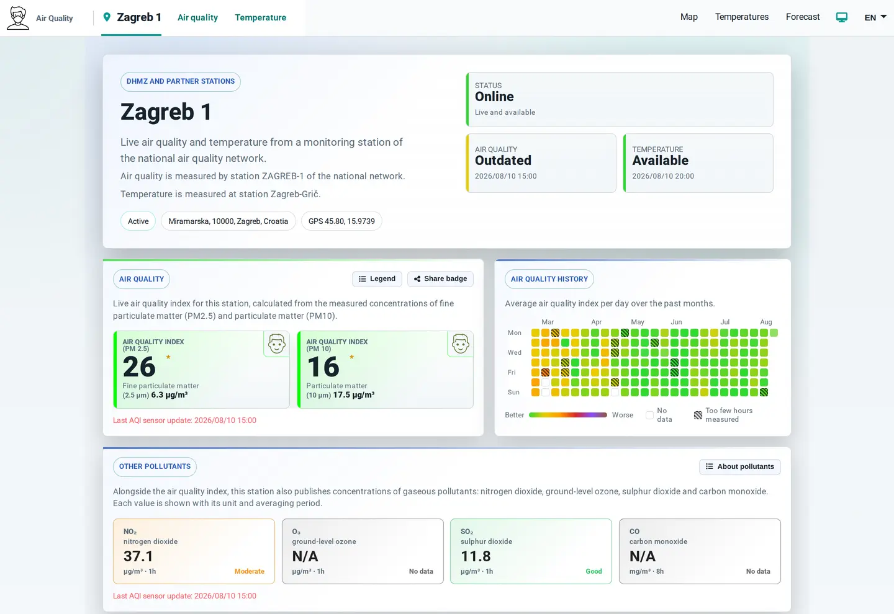
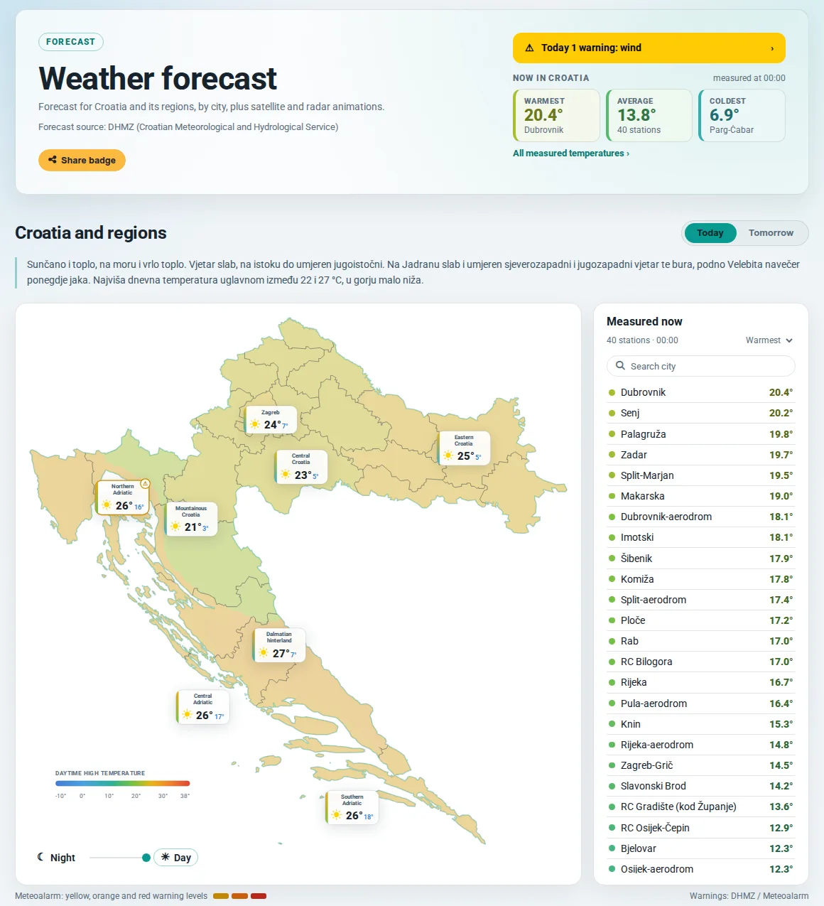
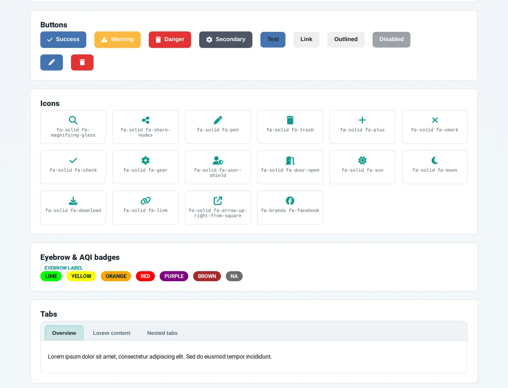
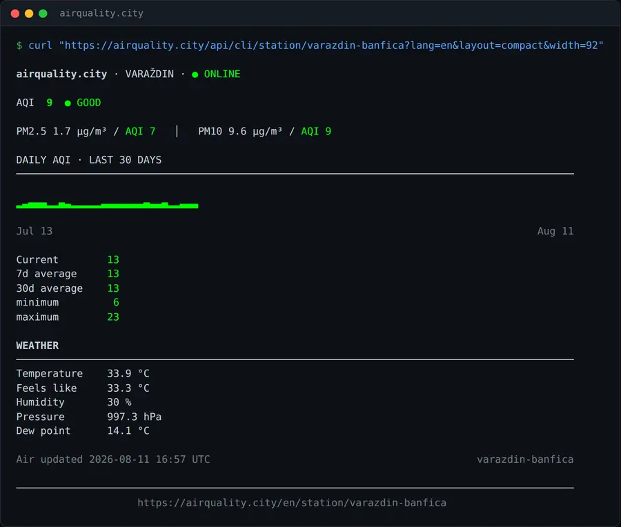
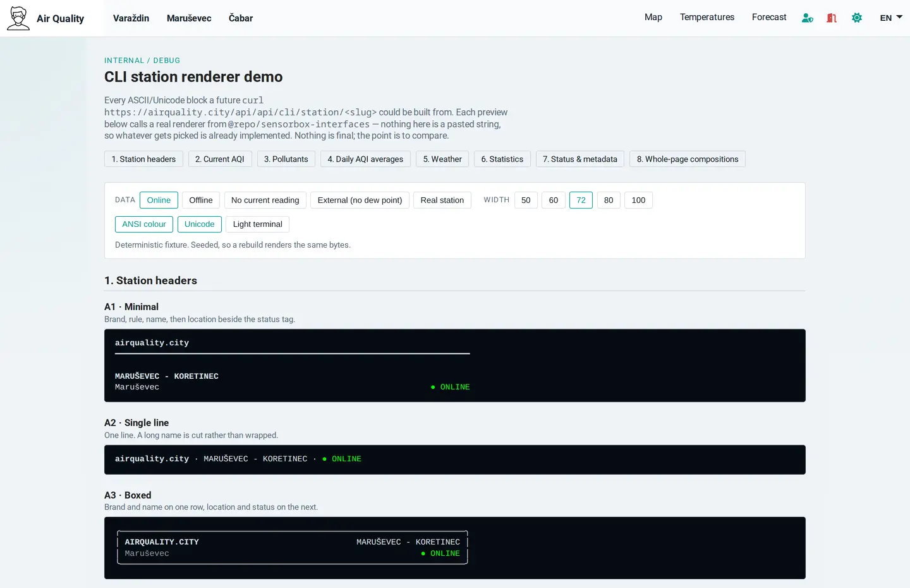

# airquality.city

<p>
  
  
  
  
  
  
  
</p>

A live air-quality monitoring platform. It combines readings from my own sensor stations with official public environmental data.
<br>

**[ -> Visit the live site](https://airquality.city)**


## Contents

- [What it is](#what-it-is) and [my role](#my-role) in it
- [Architecture](#architecture): the boundary the whole codebase is built around
- [Repository layout](#repository-layout), the same split as a directory tree
- [The back office](#the-back-office), where that boundary is easiest to see
- [Life of a reading](#life-of-a-reading), from a sensor to a rendered page
- [Three problems](#three-problems): an outage with three causes, an index that scored zero for the worst air, and an indicator that could not go stale
- [Testing](#testing): five kinds, and why each one exists
- [Two languages](#two-languages), and what bilingual costs beyond the text
- [Technology](#technology), the stack in one table
- [Screenshots](#screenshots) of the public site and the operations view
- [It also speaks terminal](#it-also-speaks-terminal), because the site answers `curl`

<br>

---

<br>

<picture>
  <source media="(prefers-color-scheme: dark)" srcset="assets/map-dark.webp">
  
</picture>

## What it is

Raspberry Pi stations I built and deployed send in readings. Scheduled jobs pull official measurements from public environmental and meteorological services. The system computes an EPA-style Air Quality Index, keeps the history, and publishes it on a server-rendered bilingual site: a live dashboard, a station map you can play back through time, temperature series, short-term forecasts with weather warnings, and editorial content.

Behind it runs a full back office: users and permissions, a multilingual CMS, media, menus, scheduled jobs, logs and an operational health view. [It gets its own section](#the-back-office), because it is the clearest place to see how the codebase is split.

## My role

I am the sole architect, engineer, product owner and operator. I designed the architecture, wrote the application and the Python software on the stations, and I run the production deployment. One part is not mine: the sensor's own driver firmware and the raw value it reports.

## What it does

- Current readings per station, with a pollutant breakdown
- A map of my stations and public reference stations, coloured by index, with playback at minute resolution
- History charts for air quality and temperature
- Short-term forecasts with regional weather warnings and daylight times
- Bilingual content on per-language URLs
- Administration, content management and a media library
- Scheduled ingestion from public services
- Background aggregation, with a health view over it


## Architecture



The dotted line is the part I would talk about first. The codebase splits into a **reusable platform core** and the **air-quality domain** built on it. Authentication, tenancy, users, roles, permissions, content, media, menus, sitemaps, contacts, newsletters, settings, migrations and logging sit in shared libraries that know nothing about air quality. Stations, pollutants, the index and the ingestion pipeline sit in the application.

A test enforces that boundary. If the core ever imports the domain, the build fails. Twenty-seven rules work this way, covering module boundaries, the API surface, the Angular surface, typing and file size. A rule only joins the list once the codebase passes it; until then it stays marked pending with a work package attached. There is no file of tolerated exceptions.

MongoDB sits behind a multi-tenant layer that opens and reuses one connection per tenant. My sensor data and the ingested public data end up in separate model spaces instead of sharing a collection with a flag on it.

Both applications ship as Docker images to one self-managed cloud host behind nginx, across production, staging and local staging, through a single scripted entry point with a rollback path.

## Repository layout

A Turborepo monorepo on npm workspaces: two applications and six libraries. The split in the table is the same split the diagram draws.

| Path | What lives there |
| --- | --- |
| `apps/sensorbox` | Angular frontend with SSR: the public site and the admin |
| `apps/sensorbox-api` | NestJS API: AQI, stations, temperatures, CMS, scheduled ingestion, the events gateway |
| `libs/app-config` | Zod-validated configuration schemas for API and client |
| `libs/core-api` | Shared backend: logging, the multi-tenant database layer, admin modules, CRUD, pagination, HTML sanitising |
| `libs/core-client` | Shared Angular services and the `core-*` component kit |
| `libs/core-interfaces` | Cross-cutting types, including the permission enums |
| `libs/sensorbox-interfaces` | Domain types: stations, AQI, external feeds, and the terminal renderers |
| `libs/i18n` | Translation catalogues, split by surface |
| `tests/` | Suites that live outside the packages: architecture, git hooks, integration, smoke, end-to-end, visual |
| `docs/architecture` | The architecture specification the fitness rules enforce |

Anything named `core-*` is domain-free. `sensorbox-interfaces` is where air quality is allowed to appear, and the fitness rules keep it that way.


## The back office

Most of the admin is not air-quality software. It is a platform back office, and the air-quality part is one group inside it. The sidebar is grouped the same way the code is.

**Control centre.** The dashboard shown below, a workspace, and the system logs, including an audit trail of who changed what.

**Core.** Users, roles and permissions, tenants, application settings, and scheduled-job control. Every job's schedule is stored and editable, so ingestion can be retimed or paused without a deploy. Switching maintenance mode reaches open browsers at once over a Socket.IO channel. That channel runs one way by design: the server broadcasts and the gateway refuses anything a client sends it. It carries exactly one message today, and I would sooner say so than call it a notification platform.

**Core modules.** Pages, news and blogs on a rich-text editor with server-side sanitisation, per-language slugs, and drafts with preview. A media library with content-hash deduplication and generated responsive variants. Menus, the sitemap, contact messages and newsletter subscribers.

**Site modules.** The air-quality domain: internal stations, external stations, the AQI and temperature series, and the aggregation health view.

Those four groups are four directories. The first three ship in the shared libraries and know nothing about air quality; only the last one lives in the application. Drop it and what remains is a working CMS and admin for something else entirely.

Permissions are cut the same way, in three enums: seven for the platform, seven for the content modules, three for the domain. The core declares its type as generic over the domain's enum, so it can type a permission it has never heard of. The same boundary shows up in the folders, in the menu and in the type system.



*Ingestion health per source, aggregation lag, sensor counts, job history, and a banner for what needs attention. This is staging, where the sensor feeds are deliberately not live, so the internal group sits in the red and names the three stations that have gone quiet. I would rather show it alerting than show it on a quiet day. Personal and host details were removed before capture.*


## Life of a reading

The private and public paths differ, so they are worth taking separately.

**From my own stations.** A station signs its own short-lived token, bound to its tenant, with the signing key stored non-selectable at the schema level. It posts air quality along with temperature, pressure and humidity. The API validates the payload, recomputes the index if the device reported a value the scale cannot justify, and writes it to that tenant's collections.

**From public services.** Scheduled jobs pull from national environmental and meteorological sources in three formats, plus a weather-warning feed. The parsers are separate from the schedulers and run against recorded fixtures. I can work on ingestion without a live source, and a provider's outage does not look like my bug. Normalised readings land as external stations in their own model space.

The paths converge after that. A background worker builds precomputed rollups at five resolutions for air quality and temperature. A health view reports run status, checkpoint lag, drift and source freshness per job. REST endpoints serve current and historical data, and the Angular application renders server-side, so a crawler and a browser get the same page.


## Three problems

### One outage, three causes

A monitor reported rate-limit rejections on a public endpoint. The application log was full of a different error. It looked like one fault. It was three, stacked.

**Proxy trust.** The API never accepted the forwarded client address, so every request in the world shared one identity. A per-client rate limit was acting as one global bucket for the entire internet. The configuration looked correct on its own, so reading it proved nothing. I sent the same number of requests twice, once with distinct client identities and once with a single one, and compared. Only one explanation fits both results.

**SSR hairpinning.** Server-side rendering fetched its data over the public URL. Every page render left the host and came back through the reverse proxy as traffic from a single address, which the proxy then rate-limited. The edge log showed hundreds of requests from one internal client with a Node user agent.

**Silent degradation.** One failed fetch during rendering collapsed the whole render into a client-side shell, returned with a 200. A browser handles that fine. A crawler gets an empty page and no error. The page looked normal, so I found it by measuring response size and DOM element counts.

I reproduced and fixed each cause on its own.

### The index scored zero for the worst air

Readings above the top breakpoint of the index scale fell through to zero. The worst air a sensor could report produced the most reassuring number on the screen. Nobody writes a test for the case past the end of the table, so nothing caught it.

The fix has four parts. A clamp in the calculation. One shared scale for the server and the client, since two copies of a formula will eventually disagree. A guard at ingestion, because the stations compute the index themselves and their firmware is not mine to change. And a migration with dry-run and apply modes for the historical records, safe to run twice.

### The freshness indicator could not go stale

Freshness was computed once when a reading arrived and stored with it. That holds until requests start failing. Then nothing writes a new freshness value and the indicator stays green forever, exactly when it matters most.

Freshness is now derived from each reading's own timestamp against a shared clock. It decays on its own as data ages, whether or not any request succeeds. Getting there meant moving the live-data components onto signals and stripping out the manual change-detection code that had built up around them, which cleared two other bugs on the way.

Testing it needs a check that runs while nothing happens, so it runs nightly against production: two browser tabs, one long-lived and one freshly loaded, compared over several hours.


## Testing

Different questions need different kinds of test, so there are five.

**Unit tests** in Vitest across the frontend, the API and the shared libraries.

**Architecture tests** that parse the codebase into a syntax tree and assert the twenty-seven rules. The suite also tests itself: each rule is checked for its ability to fail, since a rule that cannot fail still reports success.

**Contract tests** that boot a real Nest module with the real validation pipe, because a decorator-based contract behaves differently under a test runner that drops decorator metadata. I found that the hard way, chasing five failures that were the runner and not the code.

**Integration tests** against a real MongoDB container, for the things a mock cannot answer, such as whether a unique index actually exists.

**End-to-end tests** in Playwright, covering the public site, the admin, version recovery, and accessibility.

The unit, architecture and lint gates run before every commit, on my machine. The integration suite stays out of that gate on purpose: it needs Docker, and a check that cannot run on a day when Docker is down would only teach me to skip it.

Accessibility runs through axe in the end-to-end suite. Colour contrast is checked by calculation and not by eye, which is how a token literally named "strong" turned out to sit at 4.31:1 against one of the light surfaces, under the 4.5:1 it was there to guarantee.


## Two languages

The site runs in English and Croatian, and the second language reaches further than the text.

Translation catalogues are split by surface, so the public site, the admin and the shared core each carry their own, and a missing key is missing in one place instead of everywhere.

URLs are translated too. A station is `/hr/stanica/…` in Croatian and `/en/station/…` in English, and content slugs differ per language as well. That is more work than swapping a prefix: switching language has to translate the rest of the path, and every internal link has to be built from the same table, or the reader lands on a URL spelled for the other language.

Pages carry hreflang, and each language has its own canonical. Both are derived from a single method, since a page that claims one canonical while advertising a different set of alternates contradicts itself, and search engines resolve that by ignoring both.

<br>

## Technology

| Area | Technology |
|---|---|
| Frontend | Angular with server-side rendering, TypeScript, standalone components, functional routing, signals, RxJS, a custom component layer on the Angular CDK |
| Backend | NestJS, Node.js, REST with OpenAPI, Socket.IO for server-owned events |
| Data | MongoDB, Mongoose, per-tenant connections, a migration subsystem with dry-run and apply modes |
| Visualisation | MapLibre GL, Chart.js |
| Devices | Raspberry Pi, Python |
| Delivery | Docker, Linux, nginx |
| Tooling | Turborepo, Vitest, ESLint, Stylelint, Playwright |

On scale: a small fleet of my own devices, plus roughly three dozen ingested public reference stations.

## Screenshots

The map at the top of this page is the live station view. Stations are coloured by index over an interpolated surface, with a ranked list on the right. It draws on a MapLibre canvas source instead of markers, which is what keeps it smooth while stepping through time.



*A real week from the live site. The scrubber runs at minute resolution and the surface is recomputed per frame. This capture steps every two hours so the week fits in a few seconds. Most of the country stays in the lower bands while the east and parts of the coast climb into yellow and orange, which is the comparison the map is for.*

<br>

<picture>
  <source media="(prefers-color-scheme: dark)" srcset="assets/dashboard-dark.webp">
  
</picture>

*The public overview. Each station shows its index for both particulate fractions, with temperature, humidity, pressure, heat index and dew point, and badges for whether it is active and what it is currently reporting.*

<br>

<picture>
  <source media="(prefers-color-scheme: dark)" srcset="assets/station-dark.webp">
  
</picture>

*A station page, and an accidental demonstration of the third problem above. When I captured it, this station's air-quality feed was hours behind its temperature feed, so one reads "Outdated" in amber and the other "Available" in green, each with the timestamp it is judging. Both are derived from the reading's own age. The calendar is daily index history, and it keeps "no data" and "too few hours measured" apart instead of averaging a partial day into a confident number.*

<br>

<picture>
  <source media="(prefers-color-scheme: dark)" srcset="assets/forecast-dark.webp">
  
</picture>

*Regional forecast from public meteorological feeds, with weather warnings per region on a shared temperature scale. Rendered server-side in the page's language.*

<br>

<picture>
  <source media="(prefers-color-scheme: dark)" srcset="assets/core-demo-dark.webp">
  
</picture>

*Part of my internal catalogue of the shared component layer: button variants, the icon set, index-tone badges, tabs. Every block is the real component, not a picture of one. After the third-party UI framework came out, all of this became mine to keep consistent, and this page is where I check it, in both themes, against the public styles. The page's own annotations are cropped out here.*


## It also speaks terminal

The site answers `curl` with output meant for a terminal.

```bash
curl https://airquality.city/api/cli                     # the whole network
curl https://airquality.city/api/cli/station/varazdin-banfica   # one station
curl https://airquality.city/api/cli/forecast            # forecast and weather alerts
```



*Live output. ANSI colour, box drawing and block characters, with `width`, `color`, `unicode`, `lang` and `layout` as query options so it degrades cleanly on a narrow terminal, a monochrome one, or into a pipe.*

This is not a scraper and not a second implementation. The terminal renderers live in the shared library next to the domain types, so both views read the same data and a change to the index scale reaches both. The catalogue route carries its own throttle and cache policy, because it fans out across every station instead of reading one. Each row prints the command that opens that station, so you can navigate the whole thing from the shell.

<picture>
  <source media="(prefers-color-scheme: dark)" srcset="assets/cli-demo-dark.webp">
  
</picture>

*How the terminal output gets decided. Every block is a real renderer call. The controls switch the fixture between online, offline, no current reading and a station without a dew point, then re-render at 50, 60, 72, 80 or 100 columns, with ANSI colour and Unicode independently on or off. The fixture is seeded, so a rebuild gives the same bytes and any diff is a real change.*


## Engineering workflow

I use Claude and Codex as implementation and review tools. Architectural decisions and the final review stay with me. Project context, decisions and per-area notes live in their own repository, separate from the application, so the reasoning behind a change outlives the diff.

The architecture came first. The system started as an Nx monorepo with a custom component layer, which I designed and wrote, and which I later converted to Turborepo myself.


## What I would do differently

- **Continuous integration on a clean machine.** The gates run locally before commit. That catches a lot, but not what only fails on a machine that is not mine.
- **Centralised logging.** Diagnosing that outage meant reading three logs in three places. It worked at this size and would not at twice it.
- **End-to-end browser tests as a gate.** They exist and they are useful. They are not yet the thing standing between a regression and production.


## Project status

The platform is live in production and I operate it. **This repository is a public technical showcase. The source code is private.**

It is a personal project, not a commercial one. That is why there are no traffic or uptime figures here: I have not instrumented them, and I would rather show the engineering than a number I cannot back up.


## Links

- **Live site:** [airquality.city](https://airquality.city)
- **Forecast, temperature and warning data:** [DHMZ](https://meteo.hr), the Croatian Meteorological and Hydrological Service
- **Air-quality data:** my own Raspberry Pi stations, compared against the Croatian national air-quality monitoring network
- **LinkedIn:** [davormalnar](https://www.linkedin.com/in/davormalnar/)
- **Contact:** davor.malnar@proton.me

---

*Sensorbox / airquality.city. Designed, built and operated by Davor Malnar.*
