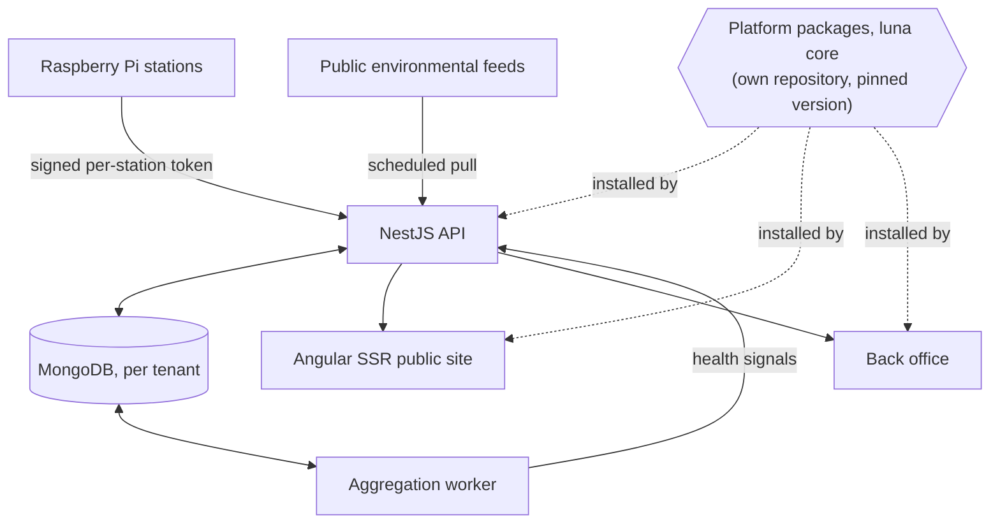
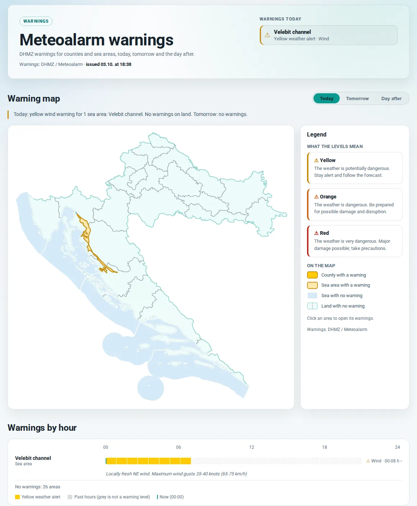

# airquality.city

<p>
  
  
  
  
  
  
  
</p>

A live air-quality monitoring platform. It combines readings from my own sensor stations with official public environmental data.
<br>

**[ -> Visit the live site](https://airquality.city)**


## Contents

- [What it is](#what-it-is) and [my role](#my-role) in it
- [Architecture](#architecture): the boundary the whole codebase is built around
- [The platform](#the-platform), the half of that boundary that left the repository and now ships as versioned packages
- [Repository layout](#repository-layout), the same split as a directory tree
- [The back office](#the-back-office), where that boundary is easiest to see
- [Life of a reading](#life-of-a-reading), from a sensor to a rendered page
- [Five problems](#five-problems): an outage with three causes, an index that scored zero for the worst air, an indicator that could not go stale, a framework update that turned one URL into a 500, and a warning feed whose silence read as calm
- [Testing](#testing): what runs before every commit, what runs against a deployment, and why the two are kept apart
- [Two languages](#two-languages), and what bilingual costs beyond the text
- [Technology](#technology), the stack in one table
- [Screenshots](#screenshots) of the public site and the operations view
- [It also speaks terminal](#it-also-speaks-terminal), because the site answers `curl`

<br>

---

<br>

<picture>
  <source media="(prefers-color-scheme: dark)" srcset="assets/map-dark.webp">
  
</picture>

## What it is

Raspberry Pi stations I built and deployed send in readings. Scheduled jobs pull official measurements from public environmental and meteorological services. The system computes an EPA-style Air Quality Index, keeps the history, and publishes it on a server-rendered bilingual site: a live dashboard, a station map you can play back through any week of the last two years, temperature series, short-term forecasts, a page of official weather warnings, and editorial content.

Behind it runs a full back office: users and permissions, a multilingual CMS, media, menus, scheduled jobs, logs, visitor statistics and an operational health view. [It gets its own section](#the-back-office), because it is the clearest place to see how the codebase is split.

## My role

I am the sole architect, engineer, product owner and operator. I designed the architecture, wrote the application, the platform it runs on and the Python software on the stations, and I run the production deployment. One part is not mine: the sensor's own driver firmware and the raw value it reports.

## What it does

- Current readings per station, with a pollutant breakdown
- A map of my stations and public reference stations, coloured by index, with playback at minute resolution over the last day, the last week, or any past week up to two years back
- A station's last twelve months as a daily index calendar, on its own page and in its map popup
- History charts for air quality and temperature
- Short-term regional forecasts with daylight times, and the temperatures measured across the country right now
- Official weather warnings for counties and sea areas, on a page of their own
- Bilingual content on per-language URLs
- Administration, content management and a media library
- Scheduled ingestion from public services
- Background aggregation, with a health view over it


## Architecture



The dotted lines are the part I would talk about first. The codebase splits into a **reusable platform** and the **air-quality domain** built on it. Authentication, tenancy, users, roles, permissions, content, media, menus, sitemaps, contacts, newsletters, settings, migrations, logging, visitor statistics and the server-side rendering host belong to the platform, which knows nothing about air quality. Stations, pollutants, the index and the ingestion pipeline belong to the application.

That split used to be a folder convention inside one repository. It is now a repository boundary: the platform lives in its own repository and is released as versioned packages, and this application installs a pinned version of them like any other dependency. [The next section](#the-platform) is about what that took.

Rules enforce the boundary. Thirty-six of them parse the code and fail the build, covering module boundaries, the API surface, the Angular surface, typing, file size and text. The rule engine is itself one of the platform packages, and every repository runs it against its own workspace. Five of the rules guard the platform side, for example that the platform never imports a product or names one, so they run in the platform's repository; here they report as not applicable, say where they do run, and are counted apart. A green run reads "30 of 30 enforced, 6 not applicable", never "36 passed". A rule only joins the list once the codebase passes it; until then it stays marked pending with a work package attached. There is no file of tolerated exceptions.

MongoDB sits behind a multi-tenant layer that opens and reuses one connection per tenant. My sensor data and the ingested public data end up in separate model spaces instead of sharing a collection with a flag on it.

Both applications ship as Docker images to one self-managed cloud host behind nginx, across production, staging and local staging, through scripted entry points with a rollback path.


## The platform

Internally the platform is called **luna core**; on this page it is just "the platform". It is private for now, like the application.

Moving the core out of the application was the largest change the codebase has been through, and most of the work was not moving files. It was finding every place where the core quietly assumed this product: a route word, a product name in a cookie, a navigation path relative to where the admin happened to be mounted. Each of those became a declaration the application makes and the platform reads. Rules now keep them from coming back.

Once the platform is a dependency, three questions need an answer that is not "it works on my machine".

**Which version is running.** The application pins an exact platform version, and the admin dashboard shows the release a deployment is actually running. A release is built from a tagged commit that has been pushed, never from a working copy: a version whose source exists only on one machine can never be rebuilt.

**Whether a version can be rebuilt.** The packages are published to a private registry, and the registry is not part of the source tree. The pin travels through git, the package files do not. On another machine, one command rebuilds the pinned versions from their tag and checks every package against the integrity hash in the lockfile before it publishes anything. One mismatch publishes nothing. That check found a real defect the first time it ran: one package failed it while the other seven matched byte for byte, because its tarball carried compiler build state that was there only if a type check happened to run before packing. The version had been reproducible from its commit only by accident.

**How to change both at once.** A developer switch points the application at a local checkout of the platform instead of the registry copy, without touching the manifest or the lockfile, so the registry install stays the only path to production. Releasing reverses it: publish in dependency order, repin, reinstall, and run the application's gates against the published copy before linking back. A platform change reaches production only after it has been published and the application has passed against it.


## Repository layout

A Turborepo monorepo on npm workspaces: two applications and three domain libraries. The platform is not in this tree; it arrives as packages.

| Path | What lives there |
| --- | --- |
| `apps/client` | Angular frontend with SSR: the public site and the admin |
| `apps/api` | NestJS API: AQI, stations, temperatures, forecasts and warnings, scheduled ingestion, the terminal renderers' routes |
| `libs/sensorbox-config` | Zod-validated configuration for the domain, on top of the platform's own |
| `libs/sensorbox-interfaces` | Domain types: stations, AQI, external feeds, warning areas, and the terminal renderers |
| `libs/sensorbox-i18n` | The domain's translation catalogues |
| `tests/` | Suites that live outside the packages: architecture, git hooks, integration, smoke, deploy verification, end-to-end, visual, text browser, platform tooling |
| `docs/architecture` | The architecture specification the rules enforce |

The platform repository carries the other half: the backend core, the Angular services and component kit, configuration schemas, cross-cutting types including the permission enums, translations for the shared surfaces, the SSR host, the architecture rule engine, and the shared lint and compiler settings.

Everything the application owns is named `sensorbox-*`. It is the only place air quality is allowed to appear, and the rules keep it that way.


## The back office

Most of the admin is not air-quality software. It is a platform back office, and the air-quality part is one group inside it. The sidebar is grouped the same way the code is.

**Control centre.** The dashboard shown below, a workspace, visitor statistics, and the system logs, including an audit trail of who changed what. Visitor statistics come from a cookieless beacon, one call per navigation, throttled so a script cannot inflate the counters. A separate traffic view counts requests and names the bots behind them, and it is measured at the server-rendering edge, because the API never sees a page request: nginx hands those to the renderer. Proxy headers are trusted only where the application explicitly opts in, since a forwarded address anyone can set is not an address.

**Core.** Users, roles and permissions, tenants, application settings, and scheduled-job control. Every job's schedule is stored and editable, so ingestion can be retimed or paused without a deploy. Switching maintenance mode reaches open browsers at once over a Socket.IO channel. That channel runs one way by design: the server broadcasts, and the only client message that gets an answer is a liveness probe that echoes back an integer, validated before the handler runs. It carries exactly one broadcast today, and I would sooner say so than call it a notification platform.

**Core modules.** Pages, news and blogs on a rich-text editor with server-side sanitisation, per-language slugs, and drafts with preview. A media library with content-hash deduplication and generated responsive variants. Menus, the sitemap, contact messages and newsletter subscribers. The site's static pages, such as the about and terms pages, are content documents too, so an alias with nothing published behind it is an honest 404 and not an empty page.

**Site modules.** The air-quality domain: internal stations, external stations, the AQI and temperature series, and the aggregation health view.

Those four groups are four directories. The first three ship in the platform packages and know nothing about air quality; only the last one lives in the application. Drop it and what remains is a working CMS and admin for something else entirely.

Permissions are cut the same way, in three enums: seven for the platform, nine for the content modules, three for the domain. The platform declares its type as generic over the domain's enum, so it can type a permission it has never heard of. The same boundary shows up in the repositories, in the menu and in the type system.


*Ingestion health per source, aggregation lag, sensor counts, job history, and a banner for what needs attention. This is staging, where the sensor feeds are deliberately not live, so the internal group sits in the red and names the three stations that have gone quiet. I would rather show it alerting than show it on a quiet day. Personal and host details were removed before capture.*


## Life of a reading

The private and public paths differ, so they are worth taking separately.

**From my own stations.** A station signs its own short-lived token, bound to its tenant, with the signing key stored non-selectable at the schema level. It posts air quality along with temperature, pressure and humidity. The API validates the payload, recomputes the index if the device reported a value the scale cannot justify, and writes it to that tenant's collections.

**From public services.** Scheduled jobs pull from national environmental and meteorological sources in three formats, plus a weather-warning feed. The parsers are separate from the schedulers and run against recorded fixtures. I can work on ingestion without a live source, and a provider's outage does not look like my bug. Normalised readings land as external stations in their own model space.

The paths converge after that. A background worker builds precomputed rollups at five resolutions for air quality and temperature. A health view reports run status, checkpoint lag, drift and source freshness per job. REST endpoints serve current and historical data, and the Angular application renders server-side, so a crawler and a browser get the same page. Data the server already fetched travels to the browser inside the page, and a test fails if the browser fetches it a second time after hydration.


## Five problems

### One outage, three causes

A monitor reported rate-limit rejections on a public endpoint. The application log was full of a different error. It looked like one fault. It was three, stacked.

**Proxy trust.** The API never accepted the forwarded client address, so every request in the world shared one identity. A per-client rate limit was acting as one global bucket for the entire internet. The configuration looked correct on its own, so reading it proved nothing. I sent the same number of requests twice, once with distinct client identities and once with a single one, and compared. Only one explanation fits both results.

**SSR hairpinning.** Server-side rendering fetched its data over the public URL. Every page render left the host and came back through the reverse proxy as traffic from a single address, which the proxy then rate-limited. The edge log showed hundreds of requests from one internal client with a Node user agent.

**Silent degradation.** One failed fetch during rendering collapsed the whole render into a client-side shell, returned with a 200. A browser handles that fine. A crawler gets an empty page and no error. The page looked normal, so I found it by measuring response size and DOM element counts.

I reproduced and fixed each cause on its own.

### The index scored zero for the worst air

Readings above the top breakpoint of the index scale fell through to zero. The worst air a sensor could report produced the most reassuring number on the screen. Nobody writes a test for the case past the end of the table, so nothing caught it.

The fix has four parts. A clamp in the calculation. One shared scale for the server and the client, since two copies of a formula will eventually disagree. A guard at ingestion, because the stations compute the index themselves and their firmware is not mine to change. And a migration with dry-run and apply modes for the historical records, safe to run twice.

### The freshness indicator could not go stale

Freshness was computed once when a reading arrived and stored with it. That holds until requests start failing. Then nothing writes a new freshness value and the indicator stays green forever, exactly when it matters most.

Freshness is now derived from each reading's own timestamp against a shared clock. It decays on its own as data ages, whether or not any request succeeds. Getting there meant moving the live-data components onto signals and stripping out the manual change-detection code that had built up around them, which cleared two other bugs on the way.

Testing it needs a check that runs while nothing happens, so it runs nightly against production: two browser tabs, one long-lived and one freshly loaded, compared over several hours.

### A doubled slash became a 500

Right after a framework update, production started answering some requests with a 500. The update had made the server renderer refuse any path that starts with two slashes, because `//hr` can be read as a protocol-relative URL to another host. Nothing on the site links to such a path, but requests for one arrive anyway, and every one of them threw inside the render.

The fix sits in the redirect layer in front of the renderer: it collapses the leading slashes into one and answers with a permanent redirect, then applies every other redirect rule to the result, so a doubled slash on a retired or wrong-language URL still lands in one hop. The deployment smoke test now asks for a doubled-slash URL, because the next update can move the same edge again.

### Silence from the warning feed read as calm

The forecast page states whether official weather warnings are out. When the warning feed failed or timed out, the page received an empty list, and an empty list is exactly what a calm day looks like. A failed request printed "no warnings today". The shareable forecast image did the same.

The fix is a third state. A failed or timed-out warning layer is now unknown, not empty, and every place that shows warnings has to handle it: the page says the warning status is unavailable, in a neutral colour and still linking to the warnings page, and the share image prints a dash instead of a count. The same bug had a cousin: a day warned only at sea counted as quiet, because two builders each kept their own copy of "worst warning" and both skipped the sea. They now read one shared function, and the test that pinned the old behaviour was inverted, not deleted.


## Testing

Different questions need different kinds of test, and they split into two groups: the ones that run before every commit, and the ones that need something running.

**Before every commit**, on my machine:

- **Unit and contract tests** in Vitest across the frontend, the API and the domain libraries. The contract tests boot a real Nest module with the real validation pipe, because a decorator-based contract behaves differently under a test runner that drops decorator metadata. I found that the hard way, chasing five failures that were the runner and not the code.
- **The architecture rules**, described [above](#architecture). The rule engine also tests itself: each rule is checked for its ability to fail, since a rule that cannot fail still reports success.
- **Lint and type checks**, with no tolerated warnings, and a style-lint ceiling that may only go down.
- **Tests of the commit hook itself**, because a gate that can be switched off without a trace is not a gate. Every bypass leaves a line in the commit message.

The gate always runs with the build cache disabled. It once reported every task green while the API tests were failing, because most of the results were replayed from cache.

**Against something running**, on demand:

- **Integration tests** against a real MongoDB container, for the things a mock cannot answer: whether a unique index actually exists, and whether the main public reads use an index or scan the collection.
- **End-to-end tests** in Playwright, covering the public site, the admin, version recovery, accessibility through axe, and a detector for data fetched twice across hydration.
- **Visual regression**, pixel comparison of the main pages in both themes against baselines recorded from the main branch.
- **A text-browser pass** that renders every public route in `lynx` and checks that the content is there without CSS or JavaScript.
- **Deployment verification.** After every deploy a script waits until the host serves the build that was just shipped, runs the smoke suite against it, and reports one of three outcomes: passed, failed, or could not run. The third exists so a network blip on my side is not mistaken for a broken release. The script has its own test suite, which checks that it can actually fail.

The second group stays out of the commit gate on purpose: it needs Docker, a browser or a deployment, and a check that cannot run on a day when one of those is down would only teach me to skip it.

Colour contrast is checked by calculation and not by eye, which is how a token literally named "strong" turned out to sit at 4.31:1 against one of the light surfaces, under the 4.5:1 it was there to guarantee. Where a colour carries meaning, such as a warning level, a test computes the ratio and fails below the threshold.


## Two languages

The site runs in English and Croatian, and the second language reaches further than the text.

Translation catalogues are split by surface, so the public site, the admin and the shared platform each carry their own, and a missing key is missing in one place instead of everywhere. A test fails when interface copy is written into a template instead of going through a key.

URLs are translated too. A station is `/hr/stanica/…` in Croatian and `/en/station/…` in English, the warnings page is `/hr/upozorenja` and `/en/warnings`, and content slugs differ per language as well. That is more work than swapping a prefix: switching language has to translate the rest of the path, and every internal link has to be built from the same table, or the reader lands on a URL spelled for the other language. A URL spelled in the wrong language, or one that has been retired, answers with a single permanent redirect to the right one, built from the same table.

Pages carry hreflang, and each language has its own canonical. Both are derived from a single method, since a page that claims one canonical while advertising a different set of alternates contradicts itself, and search engines resolve that by ignoring both.

<br>

## Technology

| Area | Technology |
|---|---|
| Frontend | Angular with server-side rendering, TypeScript, standalone components, functional routing, signals, RxJS, a custom component layer on the Angular CDK |
| Backend | NestJS, Node.js, REST with OpenAPI, Socket.IO for server-owned events |
| Data | MongoDB, Mongoose, per-tenant connections, a migration subsystem with dry-run and apply modes that never migrates unless a deployment explicitly enables it |
| Visualisation | MapLibre GL, Chart.js, hand-built SVG for the forecast and warning maps |
| Devices | Raspberry Pi, Python |
| Delivery | Docker, Linux, nginx, a private npm registry for the platform packages |
| Tooling | Turborepo, Vitest, ESLint, Stylelint, Playwright |

On scale: a small fleet of my own devices, plus roughly three dozen ingested public reference stations.

## Screenshots

The map at the top of this page is the live station view. Stations are coloured by index over an interpolated surface, with a ranked list on the right. It draws on a MapLibre canvas source instead of markers, which is what keeps it smooth while stepping through time.


*A real week from the live site. The scrubber runs at minute resolution and the surface is recomputed per frame. This capture steps every two hours so the week fits in a few seconds. Most of the country stays in the lower bands while the east and parts of the coast climb into yellow and orange, which is the comparison the map is for.*

The map can also be pointed at any past week up to two years back. The picker is a month calendar in which the row is the target: hovering anywhere in a week takes the whole week. Weeks are counted in local time, so the week the clocks change is the 167 or 169 hours it really is. Stations that recorded nothing that week are drawn grey instead of being dropped, because leaving them out would hide that the network was smaller then.

<br>

<picture>
  <source media="(prefers-color-scheme: dark)" srcset="assets/dashboard-dark.webp">
  
</picture>

*The public overview. Each station shows its index for both particulate fractions, with temperature, humidity, pressure, heat index and dew point, and badges for whether it is active and what it is currently reporting.*

<br>

<picture>
  <source media="(prefers-color-scheme: dark)" srcset="assets/station-dark.webp">
  
</picture>

*A station page, and an accidental demonstration of the third problem above. When I captured it, this station's air-quality feed was hours behind its temperature feed, so one reads "Outdated" in amber and the other "Available" in green, each with the timestamp it is judging. Both are derived from the reading's own age. The calendar is daily index history, and it keeps "no data" and "too few hours measured" apart instead of averaging a partial day into a confident number.*

<br>

<picture>
  <source media="(prefers-color-scheme: dark)" srcset="assets/forecast-dark.webp">
  
</picture>

*Regional forecast from public meteorological feeds. Each region is filled in the colour of its own temperature and pulses from its low to its high; the colour walks the temperature scale itself instead of mixing the two end colours, so the middle of the cycle is a colour a real temperature has. A Night / Day control holds either end, and with reduced motion there is no pulse at all. Beside the map, the temperatures measured across the country right now, and above it the day's warnings in the warning's own colour. Rendered server-side in the page's language.*

<br>

<picture>
  <source media="(prefers-color-scheme: dark)" srcset="assets/warnings-dark.webp">
  
</picture>

*Official weather warnings for the 20 counties, the City of Zagreb and the six sea areas, for today and the next two days, with an hour-by-hour table and a summary in words. The sea areas are generated geometry: the provider's polygons are grown to the coast and the land is subtracted on a fine raster, so a narrow channel survives as one area instead of four fragments, and a warned sea is drawn differently from the warned coast beside it so the two do not read as one mass. A warning for an area the map cannot place is listed by name instead of being dropped.*

<br>

<picture>
  <source media="(prefers-color-scheme: dark)" srcset="assets/core-demo-dark.webp">
  
</picture>

*Part of my internal catalogue of the shared component layer: button variants, the icon set, index-tone badges, tabs. Every block is the real component, not a picture of one. The catalogue itself now ships with the platform next to the components it shows, and the application mounts it and adds its own domain components below, so this is where I check the kit in both themes against the public styles. The page's own annotations are cropped out here.*


## It also speaks terminal

The site answers `curl` with output meant for a terminal.

```bash
curl https://airquality.city/api/cli                            # the whole network
curl https://airquality.city/api/cli/station/varazdin-banfica   # one station
curl https://airquality.city/api/cli/forecast                   # forecast and weather warnings
curl https://airquality.city/api/cli/help                       # every route and option
```


*Live output. ANSI colour, box drawing and block characters, with `width`, `color`, `unicode`, `lang` and `layout` as query options so it degrades cleanly on a narrow terminal, a monochrome one, or into a pipe.*

This is not a scraper and not a second implementation. The terminal renderers live in the domain library next to the domain types, so both views read the same data and a change to the index scale reaches both. The catalogue route carries its own throttle and cache policy, because it fans out across every station instead of reading one, and requests that arrive while it is being rebuilt share the one read in flight. Each row prints the command that opens that station, so you can navigate the whole thing from the shell. For text browsers such as `lynx` there are two plain HTML routes beside them.

The help route is generated from a table, and a test holds that table to the controller in both directions: it reads the framework's own route and validation metadata, so a route or an option added on one side and not the other fails the build. Station names and warning texts come from outside, so the terminal sanitiser strips control characters and also the invisible Unicode ones, bidirectional overrides and zero-width characters, that could make a line reorder or hide part of itself.

<picture>
  <source media="(prefers-color-scheme: dark)" srcset="assets/cli-demo-dark.webp">
  
</picture>

*How the terminal output gets decided. Every block is a real renderer call: the controls switch the fixture between online, offline, no current reading and a station without a dew point, then re-render at 50, 60, 72, 80 or 100 columns, with ANSI colour and Unicode independently on or off. The fixture is seeded, so a rebuild gives the same bytes and any diff is a real change. Above this gallery the page now opens with the route reference and a builder that shows the exact `curl` command and runs it against the live API, so what it shows is what a terminal gets.*


## Engineering workflow

I use Claude and Codex as implementation and review tools. Architectural decisions and the final review stay with me. Project context, decisions and per-area notes live in their own repository, separate from the application, so the reasoning behind a change outlives the diff. When several tasks run at once, each gets its own git worktree, because two agents sharing one checkout will eventually overwrite each other's uncommitted work.

The architecture came first. The system started as an Nx monorepo with a custom component layer, which I designed and wrote, and which I later converted to Turborepo myself, and later still split into an application and a platform.


## What I would do differently

- **Continuous integration on a clean machine.** The gates run locally before commit. That catches a lot, but not what only fails on a machine that is not mine.
- **Centralised logging.** Diagnosing that outage meant reading three logs in three places. It worked at this size and would not at twice it.
- **End-to-end browser tests as a gate.** They exist and they are useful. They are not yet the thing standing between a regression and production.
- **A development database of its own.** Local development and staging share one. It is convenient until a process started in production mode migrates it, which happened once. Migrations now run only when a deployment explicitly enables them, but separate databases would have made that impossible instead of unlikely.


## Project status

The platform is live in production and I operate it. **This repository is a public technical showcase. The source code is private.**

It is a personal project, not a commercial one. That is why there are no traffic or uptime figures here: visitor statistics now exist, but a few weeks of them on a personal project are not a number I would put my name under.


## Links

- **Live site:** [airquality.city](https://airquality.city)
- **Forecast, temperature and warning data:** [DHMZ](https://meteo.hr), the Croatian Meteorological and Hydrological Service, and [Meteoalarm](https://meteoalarm.org)
- **Air-quality data:** my own Raspberry Pi stations, compared against the Croatian national air-quality monitoring network
- **LinkedIn:** [davormalnar](https://www.linkedin.com/in/davormalnar/)
- **Contact:** davor.malnar@proton.me

---

*Sensorbox / airquality.city. Designed, built and operated by Davor Malnar.*
